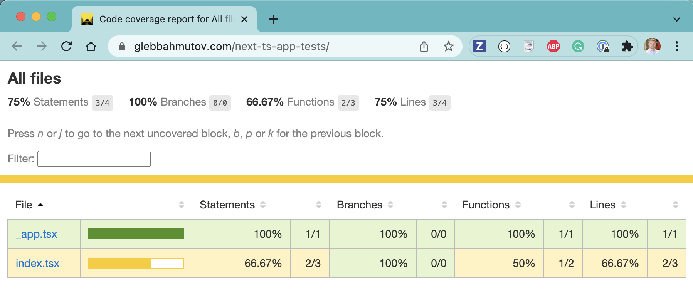

# next-ts-app

> Next.js TypeScript application example instrumented to collect code coverage using Cypress tests

Deployed to [https://next-ts-app-swart.vercel.app/](https://next-ts-app-swart.vercel.app/), instrumented using "babel-plugin-istanbul". You can find the code coverage report generated on CI in the [bahmutov/next-ts-app-tests](https://github.com/bahmutov/next-ts-app-tests) repo.

